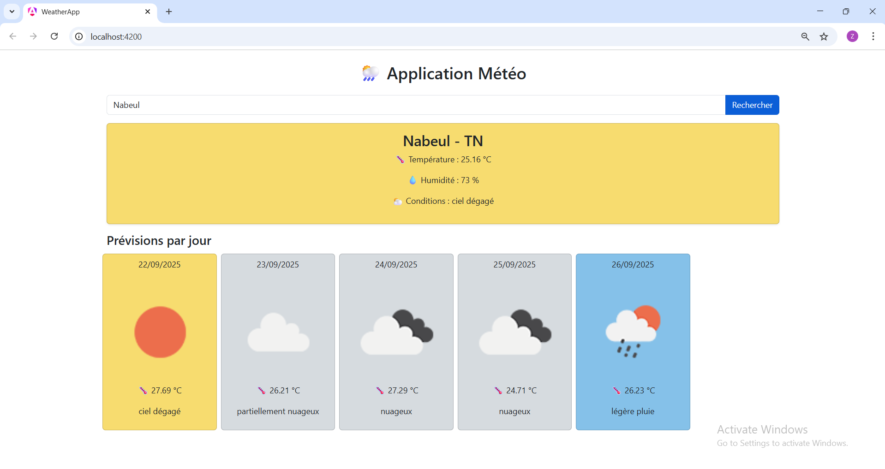

# 🌦️ Weather App - Angular 20+

Une **application météo** simple réalisée avec **Angular 20+**, utilisant les **standalone components** et la nouvelle API `provideHttpClient()`.  
Le projet affiche la météo actuelle et les prévisions pour 5 jours, avec des **couleurs et icônes dynamiques** selon les conditions météorologiques.

---

## 📸 Capture d’écran



## 📌 Fonctionnalités

- Recherche de la météo pour n’importe quelle ville.
- Affichage de :
  - Température actuelle
  - Humidité
  - Conditions météo (ex : nuageux, ensoleillé)
  - Icône météo dynamique
- Prévisions limitées à **une fois par jour (12h)**.
- Couleur de fond des cartes **adaptée à la météo**.
- Loader lors des requêtes API.
- 100% compatible **Angular 20+ et standalone components**.

---

## 🛠️ Tech Stack

- Angular 20+ (standalone components)
- TypeScript
- Bootstrap 5 pour le style
- OpenWeatherMap API

---

## 🚀 Installation

Cloner le dépôt :

```bash
git clone <URL_DU_DEPOT>
cd weather-app
```

Installer les dépendances :

```bash

npm install
```

Lancer l’application :

```bash

ng serve
```

Ouvrir dans le navigateur :

```bash
http://localhost:4200
```

🌐 API
OpenWeatherMap

Clé API gratuite .
